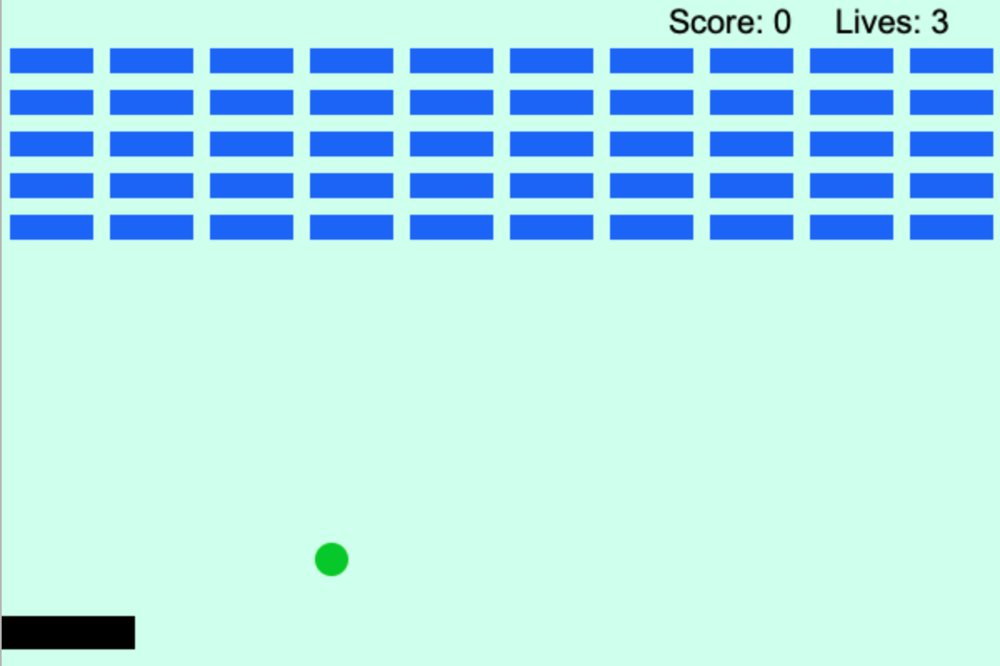
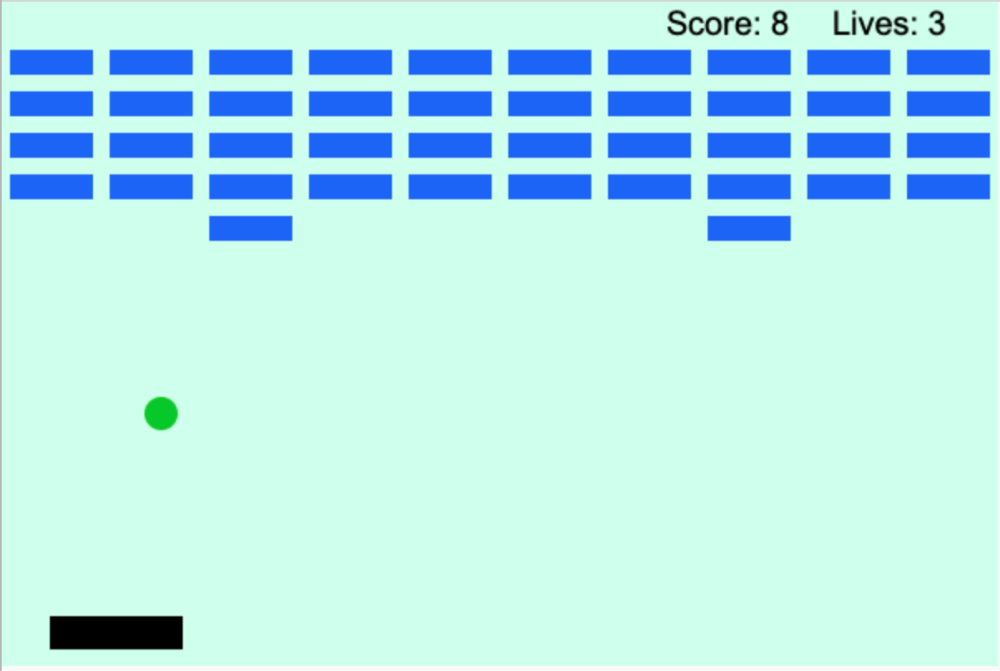
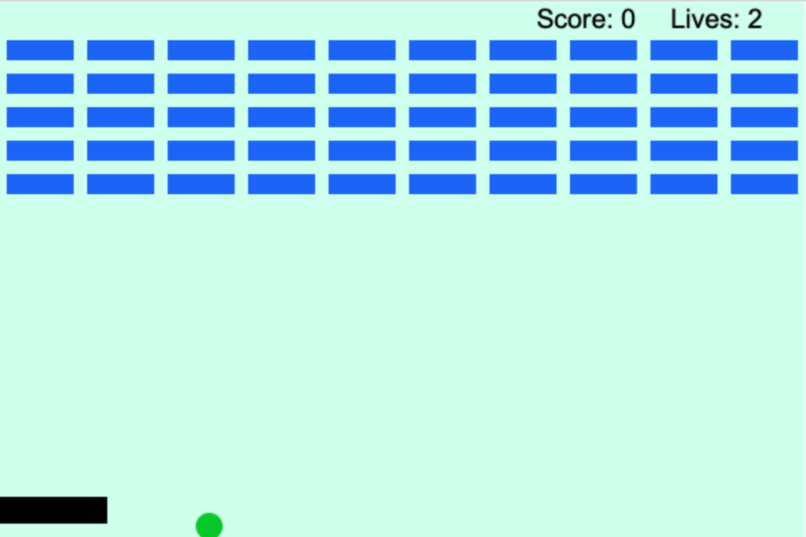
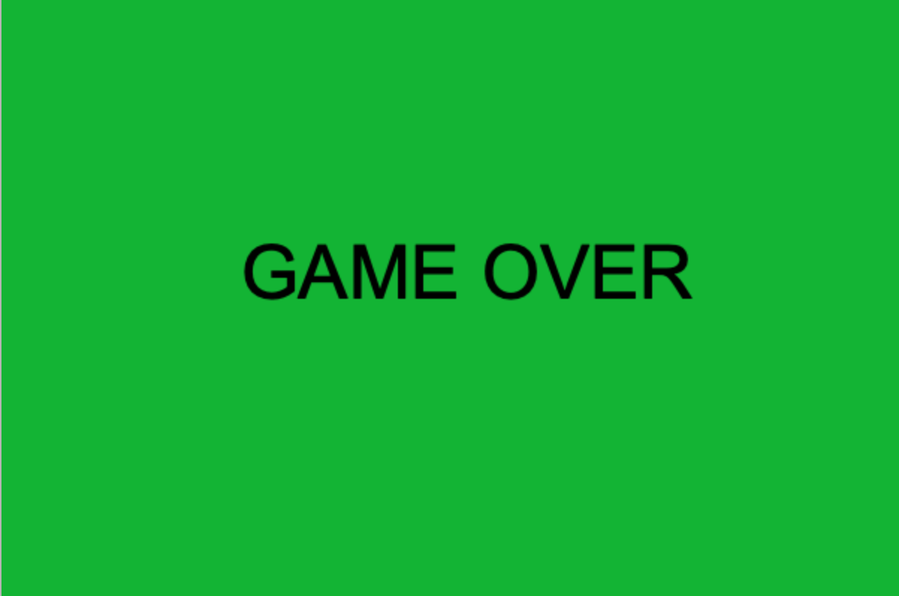

# BreakoutGame

## Description 
This project is a recreation of the famous Breakout Game, an arcade game developed by Atari and released in 1976. The goal of the game is to use a horizontal movable paddle to bounce a ball upward and destroy a layer of bricks, maximizing the score.   A score system keeps track of the player’s progress. There is also a lives system to give the player several opportunities to destroy all the bricks! If the player loses their 3 lives, the game is over.

## How to play
You control the paddle with your mouse, moving the paddle to the right and left depending on the position your mouse. You control the direction of the ball by hitting it at specific angles. You either make the ball hit the bricks directly or make it bounce off the three walls to hit the bricks. Make sure you always move the paddle to get the ball!!!!! Don't let the ball disappear at the bottom of your screen!!!!!

## Link to play
https://trinket.io/python/83608fd3d1

## Screenshots

